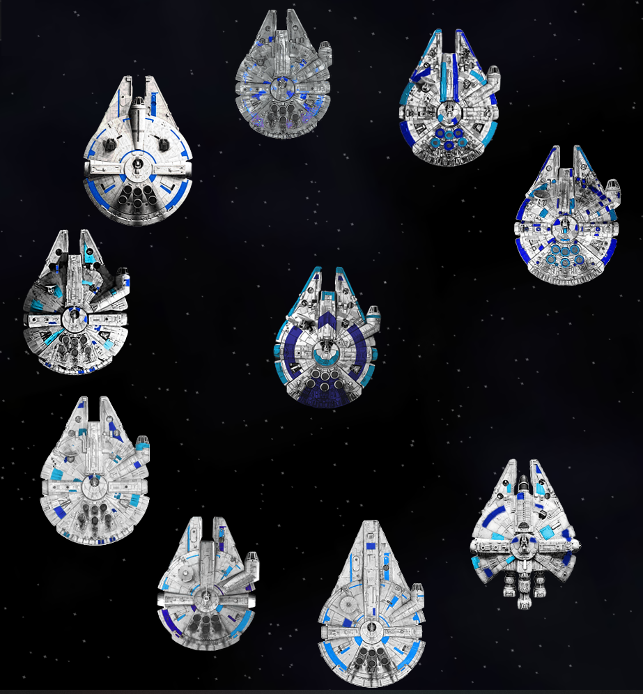

### Corellian Ships

Adds 10 ships and a beam drone from the Corellian Engineering Corporation (CEC) — a line of modular freighters and combat variants designed around hull durability and cargo capacity rather than raw firepower. These ships carry fewer hardpoints than their vanilla counterparts but compensate with better stats per ton: thicker hulls, more cargo space, and generous outfit capacity for customization. They slot into the Light Freighter through Heavy Warship range, giving independent traders, escorts, and pirates a distinct alternative to standard human ships.

Includes an alternative start scenario — begin the game as a Dirt Belt mining family's heir with a beat-up Prospector and a mountain of debt.

## Ship Lineup

| Ship | Category | Cost | Hardpoints | Role |
|------|----------|------|------------|------|
| Corellian Prospector | Light Freighter | 1.8M | 1G 2T | Rare prototype, mining focus |
| Corellian Cargo (YT-1100) | Light Freighter | 2.3M | 1G 2T | Entry-tier workhorse |
| Corellian Trader (YT-1300) | Heavy Freighter | 2.8M | 1G 2T | Modular medium freighter |
| Corellian Vagabond | Light Freighter | 2.9M | 1G 2T | Pirate scout/smuggler |
| Corellian Privateer | Heavy Freighter | 3.1M | 1G 2T | Pirate raider/boarder |
| Corellian Merchantman (YT-2000) | Heavy Freighter | 3.6M | 1G 2T | Premium armed freighter |
| Corellian Ironclad | Medium Warship | 3.4M | 4T | Combat escort conversion |
| Corellian Striker | Medium Warship | 3.8M | 2G 2T | Glass cannon, atomic engines |
| Corellian Vanguard | Medium Warship | 5.9M | 4G 2T | Luxury combat yacht |
| Corellian Fortress | Heavy Warship | 5.8M | 8T 1B | Turret sphere, convoy escort |
| CEC Beam Drone | Drone | 72k | 1G | Fortress companion, beam laser |

### YT-Series Core Line

The three production freighters form a smooth progression. The YT-1100 Cargo beats the Hauler in shields, hull, and cargo at a higher price. The YT-1300 Trader solidly outperforms the Argosy in hull and cargo at the cost of fewer hardpoints and weaker shields. The YT-2000 Merchantman competes with the Mule at a lower price — better hull and cargo, but weaker shields and less outfit space. All three use ion or plasma engines and carry a single gun with dual turrets.

### Specialists

The Fortress is an eight-turret defensive sphere with a drone bay carrying a CEC Beam Drone — pure escort duty with almost no cargo. The Ironclad strips the YT-1100 down to a four-turret combat platform for militia and convoy protection. The Striker pushes a modified YT-1300 hull into glass cannon territory with atomic engines and twin heavy lasers — CEC warranties explicitly exclude "shield failure events." The Vanguard is a luxury combat yacht with quad proton guns — the most expensive and versatile ship in the lineup.

### Rare and Pirate

The Prospector is an early YT prototype available at a single location — cheap but crew-hungry, with mining lasers fitted. The Vagabond and Privateer are pirate modifications: the Vagabond trades hull for exceptional shields and stealth gear, while the Privateer is a boarding-focused raider with a brig and marines. Pirate Corellians hunt aggressively and often operate in Vagabond-Privateer tag teams. Occasionally, stolen production models — or even a Fortress — turn up in pirate hands.

## Alternative Start: Millennium Miner

Start the game on New Boston with an inherited Corellian Prospector — a family mining ship passed down with its debts. Tighter finances than the default start (80k credits, 1M mortgage) but a bigger ship with a mining laser turret and an asteroid scanner. The start variant is weaker than the base Prospector — lower shields, less hull, fewer bunks — but comes with a loyal crewmate and a cinematic intro. A harder early game with a clear mining-focused path forward.

## Lore

A long, long time ago, a group of settlers arrived on New Sahara claiming to hail from a system no one can find on any chart. They brought with them an extraordinary knack for modular hull design, a cultural obsession with round ships, and vague references to old trade routes and a war that happened "a long time ago." They founded CEC, and their ships quickly earned a reputation across the Dirt Belt and beyond.

CEC builds hulls and frames only — no outfitter. The founders insist they could build far more advanced components, but "can't get the parts — not in this galaxy." So they design the most customizable ships they can using local technology, and leave the outfitting to you. It's the Corellian way: they build the ship, you make it yours.

There is, famously, no Medium Freighter category.

## Where to Find Them

**Factory:**
- **Corellian Engineering** — New Sahara (Phecda): Cargo, Trader, Merchantman, Ironclad, Beam Drone
- **Corellian Rare Finds** — New Boston (Rutilicus): Prospector

**Dealers:**
- **Millrace** (Fomalhaut): Ironclad
- **Wayfarer** (Tarazed): Striker
- **Valhalla** (Ultima Thule): Vanguard
- **Hephaestus** (Markab): Fortress, Beam Drone

**Black Market:**
- **Haven** (Arneb): Vagabond, Privateer, Striker

## In-Game Fleets

Corellian ships spawn as NPC traffic concentrated around the Phecda system and spreading through nearby systems. Merchant convoys, mining Prospectors, and escort patrols appear regularly. Elite Strikers and Vanguards show up occasionally in the outer ring. Pirate Corellians operate in both northern space (around Arneb) and southern space (around Antares), hunting in Vagabond-Privateer tag teams. Any Corellian ship can turn up in pirate hands — even the rare ones.

## Balance Philosophy

Corellian ships carry fewer hardpoints than vanilla ships at the same price tier. This is the core trade-off — the reduced firepower is compensated by elevated hull, shields, cargo, and outfit space. The design favors durability and customization over raw combat power. Stats scale progressively across the YT-series with no large jumps between tiers.

## Installation

Copy this plugin folder to your Endless Sky plugins directory:

- Windows: `%APPDATA%\endless-sky\plugins\`
- Mac: `~/Library/Application Support/endless-sky/plugins/`
- Linux: `~/.local/share/endless-sky/plugins/`

## Compatibility

Compatible with vanilla Endless Sky. Uses `add shipyard`, `add fleet`, and `add spaceport` to integrate with existing planets and systems without overwriting.
